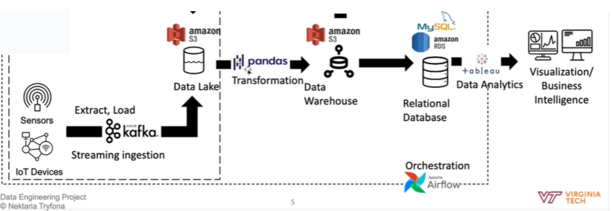
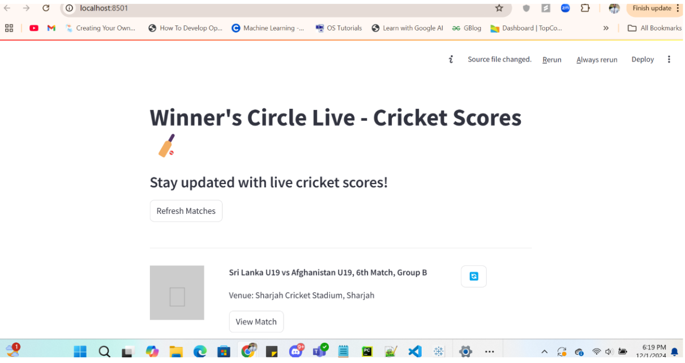
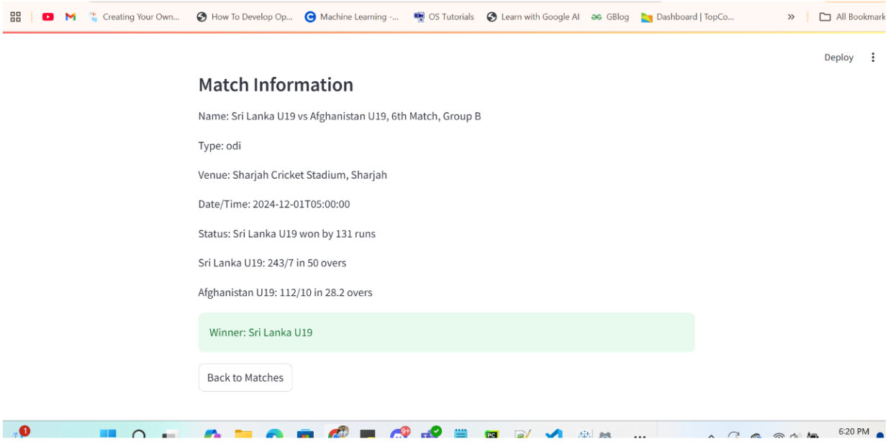

# Winners Circle Live  

## Description

---
### Overview
My project (Winner’s Circle Live!) aims to create a dynamic and interactive dashboard that visualizes live cricket data. I built a system capable of streaming, processing, and presenting real-time data in a visually engaging format. Users will be able to view live cricket match schedules, track ongoing matches, and seamlessly switch between different games happening concurrently.

### Dataset
1. Dataset : https://cricketdata.org/
2. API Docs : https://cricketdata.org/how-to-use-cricket-data-api.aspx
3. Current Matches and Match Listings: 
- Purpose: Provides information on ongoing matches and a list of all scheduled matches.
- Endpoints: 
	https://api.cricapi.com/v1/currentMatches?apikey=: Fetches data on matches currently in progress.
	https://api.cricapi.com/v1/matches?apikey=: Retrieves a comprehensive list of all cricket matches.
4. Live Score for a Specific Match:
	This API is fetched using a specific ID of the specific match.
https://api.cricapi.com/v1/match_info?apikey=xxx&offset=0&id=820cfd88-3b56-4a6e-9dd8-1203051140da: 
- Provides detailed match info, including teams, status, and other metadata for a specified match.
https://api.cricapi.com/v1/match_scorecard?apikey=xxx&offset=0&id=0b12f428-98ab-4009-831d-493d325bc555: Offers an updated scorecard for the selected match, including scores, overs, wickets, and player details.
---
### What pipeline, project, and dataset are you using?

The project is titled Winner’s Circle Live! and focuses on creating a real-time dashboard to visualize live cricket data. The data pipeline uses Kafka for real-time streaming, Amazon RDS and S3 for storage, and Apache Airflow for orchestration. The datasets are retrieved from the cricketdata.org API, which provides endpoints for current matches, match listings, and live score updates.

### Will you perform Exploratory Data Analysis? Which methods are you going to use?

Yes, Exploratory Data Analysis (EDA) will be performed to understand data patterns, distribution, and any anomalies. EDA methods will include summary statistics, time-series analysis, and visualizations (using tools like Pandas and Matplotlib) to inspect real-time trends and identify potential issues in the data stream.

### What information about data provenance have you listed? Answer the characteristic data provenance questions addressed in Module 5

The data originates from the cricketdata.org API.
It is generated and updated by an external provider CricViz and ESPN.
Changes in data over time are tracked by the live API updates internally.
The timestamp for each data update can be logged to track when changes were made.
Data changes are primarily made to deliver up-to-date match information to users.
The API data source is considered trustworthy and authentic for real-time cricket updates.

**Pipeline and Methods:** The pipeline will be built using Kafka for real-time data streaming. Kafka's distributed architecture will allow for the efficient capture and handling of live cricket data from various sources. The data will be stored and retrieved using **Amazon RDS (Relational Database Service) and Amazon S3 (Simple Storage Service)** for scalability and reliability.

The orchestration of data pipelines will be managed using Apache **Airflow**, which will schedule and execute jobs at predefined intervals, ensuring data processing and updates occur in real time. Various workflows will be created to handle different stages of the pipeline:

---
## Investigation : 

---

### Scalability : 
This project is designed to be scalable by adding extra replicas for the Kafka server. On the backend, scalability can be achieved by deploying multiple container instances, ensuring the system can handle increased workloads efficiently.

### Technical Challenges : 
One of the challenges I faced was downloading data from the S3 bucket into the producer environment. Although this was a small feature, it significantly enhances the system's capabilities. Other than this, the development process went smoothly without major issues.

### Next Phase/Future Enhancements : 
In the next phase, the system can be tested under larger workloads to evaluate its performance and reliability. Further improvements include modularizing the architecture and assigning dedicated hardware resources to each module. This approach will enable the system to handle even larger workloads effectively while maintaining scalability and efficiency.

---
# The pipeline will follow this flow:

**Live Cricket API → Kafka (Producer) → Kafka (Consumer) → Data Processing → S3/RDS (Storage) → Dashboard (Visualization)**


---
# Screenshots



## Steps to Set Up and Run the Application  

### 1. Spin a Docker Container  
Run the following command to start a Docker container:  

```bash
docker run --rm -it --entrypoint bash -v /home/ubuntu/efs-mount-point/students/<pid>/root:/root -p 8080-8130:8080 -p 9092-9142:9092 --name <pid> pipeline:latest
```

Replace `<docker_image_name>` with the appropriate Docker image you are using.  

---

### 2. Add Necessary Files to Airflow DAGs Directory  
Place the files `dag_stream.py` and `stream_ingest.py` in the Airflow DAGs directory:  

```bash
nano <file-name>
cp dag_stream.py stream_ingest.py /root/airflow/dags/
```

---

### 3. Access the EC2 Instance and Execute Inside the Docker Container  
SSH into your EC2 instance and execute the following command to enter the Docker container:  

```bash
docker exec -it <container_id> bash
```

Replace `<container_id>` with the ID of your running Docker container.  

---

### 4. Navigate to Kafka Directory  
Move to the Kafka installation directory:  

```bash
cd /home/kafka_2.13-3.5.0/
```

---

### 5. Export Kafka Heap Options  
Set the required Kafka memory heap options:  

```bash
export KAFKA_HEAP_OPTS="-Xmx256M -Xms128M"
```

---

### 6. Edit Server Properties for Kafka  
Open the Kafka server properties file for editing:  

```bash
nano config/server.properties
```

Add the following line (replacing `<ip>` and `<port>` with your server's IP address and port):  

```properties
advertised.listeners=PLAINTEXT://<ip>:<port>
```

---

### 7. Start Zookeeper  
Run the following command to start Zookeeper:  

```bash
bin/zookeeper-server-start.sh config/zookeeper.properties
```

---

### 8. Start the Kafka Server  
Run the following command to start the Kafka server:  

```bash
bin/kafka-server-start.sh config/server.properties
```

---

### 9. Add a Kafka Topic  
Create a Kafka topic named `CricketData` with the following command:  

```bash
bin/kafka-topics.sh --create --topic CricketData --bootstrap-server <ip>:<port> --replication-factor 1 --partitions 1
```

Replace `<ip>` and `<port>` with your server's IP address and port.  

---

### 10. Start Airflow  
Run Airflow with the following command:  

```bash
airflow standalone
```

You can access Airflow using the URL `http://<ip>:<port>` where `<ip>` is your server IP and `<port>` is the configured port for Airflow.  

---

## User Interface  

### UI Overview  
The user interface is a **Streamlit** Python application used to visualize data streams.  

### Steps to Run the UI Application:  
1. Navigate to the `ui/` directory:  

   ```bash
   cd ui/
   ```

2. Start the Streamlit application using the following command:  

   ```bash
   streamlit run app.py
   ```

Access the UI in your browser using the displayed Streamlit local or network URL.  

---

## Features  

- **Kafka Integration**: Handles real-time data ingestion using Kafka.  
- **Airflow Workflow**: Automated pipeline management and scheduling.  
- **Streamlit Visualization**: Interactive UI for data analysis and visualization.  
- **Scalable Architecture**: Built for handling large-scale data streams.  

---

## Prerequisites  

- Docker  
- Kafka (2.13-3.5.0)  
- Airflow  
- Python (for Streamlit)  
- EC2 Instance  

---